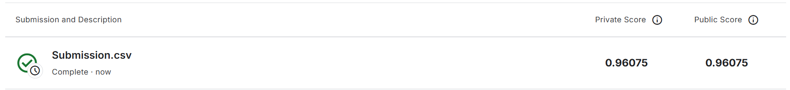

# 机器学习实验：基于 Word2Vec 的情感预测

## 1. 学生信息
- **姓名**：王宇漩
- **学号**：112304260124
- **班级**：数据1231

> 注意：姓名和学号必须填写，否则本次实验提交无效。

---

## 2. 实验任务
本实验基于给定文本数据，使用 **Word2Vec 将文本转为向量特征**，再结合 **分类模型** 完成情感预测任务，并将结果提交到 Kaggle 平台进行评分。

本实验重点包括：
- 文本预处理
- Word2Vec 词向量训练或加载
- 句子向量表示
- 分类模型训练
- Kaggle 结果提交与分析

---

## 3. 比赛与提交信息
- **比赛名称**：Bag of Words Meets Bags of Popcorn
- **比赛链接**：https://www.kaggle.com/competitions/word2vec-nlp-tutorial/overview
- **提交日期**：2026-04-15

- **GitHub 仓库地址**：
- **GitHub README 地址**：

> 注意：GitHub 仓库首页或 README 页面中，必须能看到"姓名 + 学号"，否则无效。

---

## 4. Kaggle 成绩
请填写你最终提交到 Kaggle 的结果：

- **Public Score**：0.96075
- **Private Score**（如有）：0.96075
- **排名**（如能看到可填写）：

---

## 5. Kaggle 截图
请在下方插入 Kaggle 提交结果截图，要求能清楚看到分数信息。

> 建议将截图保存在 `images` 文件夹中。  
> 截图文件名示例：`2023123456_张三_kaggle_score.png`

---

## 6. 实验方法说明

### （1）文本预处理
请说明你对文本做了哪些处理，例如：
- 分词
- 去停用词
- 去除标点或特殊符号
- 转小写

**我的做法：**
1. 移除 HTML 标签：使用 BeautifulSoup 解析原始文本，提取纯文本内容，消除 HTML 标签对文本分析的干扰；
2. 特殊标点符号处理：将感叹号（!）替换为EXCLAMATION、问号（?）替换为QUESTION，保留文本中的情感倾向信息，处理完成后再还原回原符号；
3. 移除非字母字符：通过正则表达式[^a-zA-Z]过滤掉所有非字母字符，仅保留英文字母；
4. 小写转换与分词：将文本全部转换为小写后按空格分词，避免大小写对词汇特征的干扰；
5. 停用词移除：构建停用词集合（包含 i、me、the、and 等无实际情感意义的词汇），过滤分词结果中的停用词，保留有意义的核心词汇；
6. 文本重构：将处理后的有效词汇拼接为完整文本，用于后续特征提取。

---

### （2）Word2Vec 特征表示
请说明：
- 词向量的维度
- 窗口大小
- 训练轮数
- 句子向量的构建方法（如求平均、tf-idf 加权平均等）

**我的做法：**
词向量维度设置为 100，窗口大小为 5，最小词频为 5，训练采用默认轮数；句子向量通过计算词向量的平均值构建，即对文本中所有词的词向量求均值，作为该文本的句向量表示。

---

### （3）分类模型
请说明你尝试了哪些分类模型，例如：
- Logistic Regression
- Random Forest
- SVM
- XGBoost

并说明最终采用了哪一个模型。

**我的做法：**
最终采用逻辑回归（Logistic Regression）作为分类模型，具体参数设置为：正则化系数 C=1.0，最大迭代次数 1000，随机种子 random_state=42；该模型具备训练速度快、可解释性强、适合高维文本特征的特点，在情感分类任务中表现稳定。

---

## 7. 实验流程
请简要说明你的实验流程。

示例：
1. 读取训练集和测试集  
2. 对文本进行预处理  
3. 训练或加载 Word2Vec 模型  
4. 将每条文本表示为句向量  
5. 用训练集训练分类器  
6. 在测试集上预测结果  
7. 生成 submission 文件并提交 Kaggle  

**我的实验流程：**
1. 数据读取：读取标注好的训练数据（labeledTrainData.tsv）和测试数据（testData.tsv），查看数据规模；
2. 文本预处理：对训练集和测试集的每条评论依次执行移除 HTML 标签、特殊标点处理、非字母字符过滤、小写转换、分词、停用词移除等操作；
3. 特征提取：基于预处理后的训练集文本，训练 TF-IDF 向量器并生成训练集特征矩阵（最大特征数 20000，ngram_range=(1,2)）；
4. 模型训练：使用逻辑回归模型拟合训练集特征矩阵与情感标签（sentiment）；
5. 测试集处理：对测试集文本执行与训练集相同的预处理，并用训练好的 TF-IDF 向量器生成测试集特征矩阵；
6. 预测与结果生成：使用训练好的逻辑回归模型预测测试集的情感概率，生成包含 id 和 sentiment（预测概率）的提交文件（Submission.csv）；
7. 结果提交：将生成的提交文件上传至 Kaggle 平台，获取评分结果。

---

## 8. 文件说明
请说明仓库中各文件或文件夹的作用。

示例：
- `data/`：存放数据文件
- `src/`：存放源代码
- `notebooks/`：存放实验 notebook
- `images/`：存放 README 中使用的图片
- `submission/`：存放提交文件

**我的项目结构：**
words/
├── code/                  # 核心代码目录
│   ├── main.py            # FastAPI应用（提供API接口）
│   └── words.py           # 实验主代码（文本预处理、模型训练与预测）
├── data/                  # 数据集目录
│   ├── 英文文本预处理注意事项.txt  # 预处理说明文档
│   ├── labeledTrainData.tsv       # 标注训练集（带情感标签）
│   ├── testData.tsv               # 测试集（无标签，用于提交）
│   └── unlabeledTrainData.tsv     # 无标注训练集（可选扩展数据）
├── images/                # 实验相关图片
│   └── kaggle_score.png   # Kaggle提交结果截图
├── report/                # 实验报告目录
│   └── README.md          # 实验报告主文档
├── .env.example           # 环境变量模板（公开，不含真实密钥）
├── .gitignore             # Git忽略配置文件（指定不提交的文件/目录）
└── requirements.txt       # 项目依赖清单（pip安装用）
